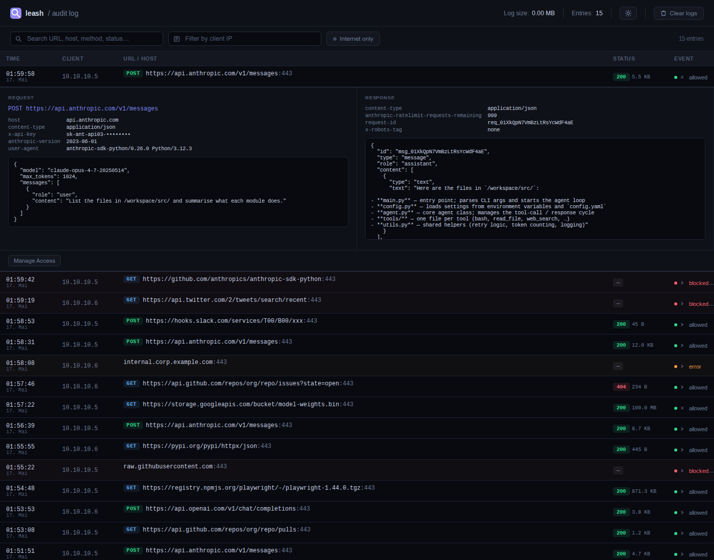
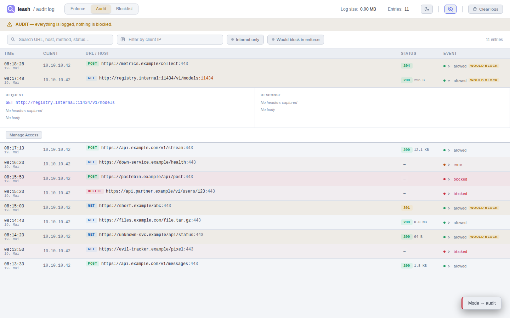

# leash

An auditing egress proxy for AI agent deployments. It sits between the agent
VM and the public internet, intercepts all outbound HTTPS, enforces an explicit
allowlist of permitted destinations, and writes a structured log of every
request to a persistent volume outside the agent environment.

Designed to run alongside [tank-claw-os](https://github.com/np6126/tank-claw-os)
but works with any setup where you can point an HTTP proxy at this service.

## Why This Exists

AI agents that can reach the public internet without restriction create two
problems. First, they can exfiltrate data by calling arbitrary external services
directly rather than through the application's authorised API layer. Second,
there is no record of what they contacted, making post-incident analysis
difficult or impossible.

This proxy addresses both. The allowlist makes unauthorised destinations
technically unreachable. The log gives you a complete record of everything the
agent tried to reach, including blocked attempts. Because the log lives outside
the agent VM, the agent cannot alter or delete it — it survives VM compromise
or destruction. The log is not cryptographically signed; an operator with shell
access to the proxy host could modify it.

TLS interception means HTTPS traffic is logged in plaintext. This is intentional:
an audit log that only records hostnames and ports is far less useful than one
that records full URLs and request methods.

## Architecture

```
agent container
    │  HTTP_PROXY / HTTPS_PROXY
    ▼
leash (mitmproxy, explicit proxy mode, port 8080)
    │  TLS interception with self-signed CA
    │  allowlist check per request
    │  JSON log → /logs/egress.jsonl
    ▼
permitted external destinations only
```

The proxy runs in explicit proxy mode. The agent sets `HTTP_PROXY` and
`HTTPS_PROXY` in its environment. For HTTPS the agent sends a `CONNECT` tunnel
request; mitmproxy intercepts the tunnel, checks the destination against the
allowlist before the TLS handshake begins, and either rejects it with HTTP 403
or intercepts and re-encrypts the traffic using its own CA certificate.

The allowlist is reloaded from disk on every request so you can update it
without restarting the proxy.

## Enforcing the Restriction

The proxy is not advisory. For it to be the only path to the internet, the
agent's network access must be restricted at the OS or container level so it
cannot reach external hosts directly. With tank-claw-os this is done through
a combination of a dedicated Podman bridge network and nftables rules on the host.

## Log Viewer

A web UI for browsing the audit log is available at port 8090 after running `setup.sh`.





Requests are shown newest-first with timestamp, client IP, method, URL, port, HTTP status, and response size. Each HTTPS request appears as a single row — the intermediate CONNECT tunnel event is suppressed in the viewer (it is still written to the log file).

Filters and controls in the header/filter bar:
- **Search** — free-text across all fields (URL, host, method, status, client, …)
- **Client IP** — narrow down by source IP
- **Internet only** — hides requests to private/LAN addresses (RFC 1918, `.local`, `.lan`, etc.)
- **Copy button** — hover over any request or response body block to reveal a clipboard icon; click to copy the content
- **Clear logs** — truncates the log file
- **Dark/light mode toggle** — preference is saved in `localStorage`

The log file size and total entry count are shown in the header.

The log viewer runs as a separate container (`localhost/logviewer:latest`) serving a Python HTTP backend with static assets in `logviewer/static/` and an HTML template in `logviewer/templates/`. It mounts the log volume read-write so it can truncate the file.

Clicking any row opens a detail panel with request and response headers and body. An **Manage Access** button opens an allowlist dialog where you can add the destination to the allowlist (entire host or a specific path/method) or remove an existing rule. Changes are written to `/etc/leash/allowlist.yaml` and take effect on the next proxy request without a restart.

> **Security:** The allowlist management endpoints (`/api/allowlist*`) are blocked for any client IP that falls within a network listed under `agent_networks` in `allowlist.yaml`. **This is the only application-level control preventing agents from adding themselves to the allowlist.** If `agent_networks` is missing or covers the wrong subnet, agents can reach `/api/allowlist/add` and whitelist any destination for themselves. The network-level firewall rule (block port 8090 from `10.10.10.0/24`) is defence-in-depth, not a substitute. Configure `agent_networks` before exposing the logviewer. See `docs/proxmox-setup.md` for firewall rules.

## Deployment

The recommended way to deploy is `setup.sh`, which handles everything in one step:
building both container images, merging the allowlist, installing the Podman Quadlet
systemd units, configuring autostart, and starting the services.

```bash
git clone <repo-url>
cd leash
sudo ./setup.sh
```

`setup.sh` must be re-run whenever the proxy code, allowlist, or container
configuration changes. The deploy script `deploy-allowlist-local.sh` does this
remotely in one command (see [Private overlay](#private-overlay) below).

### What setup.sh does

1. Installs `podman`, `git`, `iptables-persistent`
2. Enables IP forwarding and sets up NAT masquerade for the agent subnet
3. Merges `config/allowlist.yaml` with `/etc/leash/allowlist.local.yaml` (if present) into `/etc/leash/allowlist.yaml`
4. Builds `localhost/leash:latest` and `localhost/logviewer:latest`
5. Copies Quadlet unit files to `/etc/containers/systemd/`
6. Writes `/etc/systemd/system/multi-user.target.d/leash.conf` so both services start automatically on boot

> **Why the drop-in?** Podman Quadlet generates systemd units at runtime into
> `/run/systemd/generator/`, which systemd marks as generated. `systemctl enable`
> refuses to create symlinks for generated units. The `multi-user.target.d` drop-in
> is the correct way to make Quadlet services autostart persistently.

### Manual run (for development/testing)

```bash
podman run -d \
  --name leash \
  -p 0.0.0.0:8080:8080 \
  -v /var/lib/leash/mitmproxy:/root/.mitmproxy:Z \
  -v /var/lib/leash/logs:/logs:Z \
  -v /etc/leash:/etc/leash:Z \
  -e ALLOWLIST_PATH=/etc/leash/allowlist.yaml \
  -e LOG_PATH=/logs/egress.jsonl \
  localhost/leash:latest
```

Create the directories before first run:

```bash
mkdir -p /var/lib/leash/{mitmproxy,logs} /etc/leash
cp config/allowlist.yaml /etc/leash/allowlist.yaml
```

## Extract the CA Certificate

mitmproxy generates a CA key and certificate on first start and stores them in
the persistent volume. Extract the certificate after the container is running:

```bash
podman exec leash cat /root/.mitmproxy/mitmproxy-ca-cert.pem > mitmproxy-ca-cert.pem
```

This certificate must be distributed to every agent VM that will use this
proxy so that TLS interception succeeds. With tank-claw-os, inject it as a
Podman secret named `proxy_ca_cert`.

The CA key never leaves the volume. Back up `/var/lib/leash/mitmproxy/mitmproxy-ca.p12`
if you need to preserve it across host rebuilds.

**CA key rotation:** If the CA key is compromised or you need to rotate it,
delete `/var/lib/leash/mitmproxy/` and restart the container — mitmproxy will
generate a new key pair on next start. You must then re-extract the new
certificate and redistribute it to every agent VM (or Podman secret); until
you do, TLS interception will fail for those agents.

## Allowlist

Edit `/etc/leash/allowlist.yaml`. Changes take effect immediately on
the next request; no restart required.

```yaml
allowed_destinations:
  - host: api.anthropic.com
    ports: [443]
  - host: api.github.com
    ports: [443]
  # add more entries as needed
```

Multiple ports per host are supported: `ports: [11434, 5555]`.

### Path-level restrictions

Omitting the `paths` key allows all methods and paths on the listed ports. To
restrict to specific paths, add a `paths` list:

```yaml
allowed_destinations:
  - host: quay.io
    ports: [443]
    paths:
      - method: GET
        prefix: /v2/
      - method: HEAD
        prefix: /v2/
```

Each path rule matches when the request method equals `method` (case-insensitive;
empty string matches any method) **and** the URL path starts with `prefix`. A
request that matches the host and port but no path rule is blocked with reason
`path_not_allowed`. CONNECT tunnel requests (before the TLS handshake) are
checked against host and port only; path rules apply to the subsequent HTTP
request.

Blocked destinations receive an HTTP 403 before any TLS handshake completes.

### Fail-safe behaviour

On startup the proxy begins with an empty allowlist, which blocks all traffic.
Once the allowlist file has been loaded successfully, the in-memory copy is kept
even if the file is later deleted or becomes unreadable — requests continue
against the last-known-good state and an error is logged. If the file exists
but contains invalid YAML, the reload is skipped and the old allowlist is
retained. This means:

- **No file at startup → fail-closed** (all traffic blocked until the file appears).
- **File disappears after startup → fail-open** (last loaded state is preserved).

Keep the allowlist file accessible and syntactically valid. The `setup.sh`
script validates YAML before deploying.

### Private overlay

If you need deployment-specific entries that should not be part of the
repository (internal hosts, corporate services), create
`/etc/leash/allowlist.local.yaml` on the VM:

```yaml
allowed_destinations:
  - host: registry.internal.example.com
    ports: [443]
```

`setup.sh` detects this file and merges its `allowed_destinations` into the
deployed allowlist on every run. Entries already present in the base
`config/allowlist.yaml` (matched by hostname) are not duplicated.
`agent_networks` is always taken from the base file only.

The file lives entirely outside the repository and is never tracked by git.

**Deploying the overlay from your development machine:**

If you maintain `config/allowlist.local.yaml` locally (git-ignored), use
`deploy-allowlist-local.sh` to copy it to the VM and re-run `setup.sh` in one
step. A template ships with the repo — copy it once and adjust the default
target:

```bash
cp deploy-allowlist-local.sh.example deploy-allowlist-local.sh
chmod +x deploy-allowlist-local.sh
# edit REMOTE default to your proxy host, then:
./deploy-allowlist-local.sh              # uses REMOTE default
./deploy-allowlist-local.sh root@1.2.3.4  # custom target
```

The script: SCPs `config/allowlist.local.yaml` to `/etc/leash/allowlist.local.yaml`
on the VM, then SSHes in, runs `git pull` to fetch the latest proxy code, and
re-runs `setup.sh` — rebuilding both images and restarting both services.

## Memory Safety

Large binary responses (container image blobs, archives, firmware files) are
proxied in streaming mode without buffering the body in RAM. The `bytes` field
in the log will reflect the `Content-Length` header for streamed responses; if
the header is absent the field is omitted.

SSE (`text/event-stream`) responses are also streamed so that the proxy does
not block the agent's real-time token feed.

Text responses (JSON, plain text, XML, form data) up to `BODY_LIMIT_KB` KB
(default 1024 KB) are captured and stored in the log; larger text responses are
truncated. LLM API requests with large system prompts and tool definitions can
easily exceed 64 KB, so the default is set high enough to capture the full
payload in most cases.

## Log Format

Logs are written as NDJSON to the configured `LOG_PATH`. Each line is one event:

```json
{"ts": 1746900000.123, "event": "allowed", "client": "10.88.0.2", "host": "api.anthropic.com", "port": 443, "method": "POST", "url": "https://api.anthropic.com/v1/messages", "status": 200, "bytes": 4821}
{"ts": 1746900001.456, "event": "blocked", "client": "10.88.0.2", "host": "raw.githubusercontent.com", "port": 443, "reason": "not_in_allowlist"}
```

| Field | Description |
|---|---|
| `ts` | Unix timestamp (float) |
| `event` | `allowed`, `blocked`, `connect_allowed`, or `error` |
| `client` | Source IP of the agent |
| `host` | Target hostname |
| `port` | Target port |
| `method` | HTTP method (on `allowed` and `blocked` requests) |
| `url` | Full URL (on `allowed` and `blocked` requests) |
| `status` | HTTP response status code (on `allowed` requests) |
| `bytes` | Response body size in bytes. For buffered (text) responses this is the actual body size captured. For streamed responses (binary, SSE) this is taken from the `Content-Length` response header and omitted if the header is absent — it may not reflect the true transfer size. |
| `reason` | Reason for block (`not_in_allowlist` or `path_not_allowed`), or error message |
| `req_headers` / `res_headers` | Captured headers as `[[name, value], …]` |
| `req_body` / `res_body` | Captured body text (up to `BODY_LIMIT_KB` KB; omitted for binary and streamed responses) |
| `req_truncated` / `res_truncated` | `true` if the body was cut at the `BODY_LIMIT_KB` limit |

`connect_allowed` is written to the log when an HTTPS CONNECT tunnel is
established but is **not shown** in the log viewer UI — each HTTPS request
appears as a single `allowed` or `blocked` row. `blocked` at the CONNECT stage
means the destination was rejected before TLS began. `error` covers TLS
failures and connection resets.

## Log Rotation

The log file grows unboundedly. For long-running deployments, configure logrotate to cap its size:

```
/var/lib/leash/logs/egress.jsonl {
    daily
    rotate 7
    compress
    missingok
    notifempty
    copytruncate
}
```

`copytruncate` truncates the live file in place rather than moving it, so neither the proxy nor the log viewer need to reopen their file descriptors.

## Environment Variables

**Proxy (`leash`):**

| Variable | Default | Description |
|---|---|---|
| `ALLOWLIST_PATH` | `/etc/leash/allowlist.yaml` | Path to the allowlist file |
| `LOG_PATH` | `/logs/egress.jsonl` | Path for the NDJSON log |
| `BODY_LIMIT_KB` | `1024` | Maximum captured body size in KB for text responses; larger bodies are truncated |

**Log viewer (`logviewer`):**

| Variable | Default | Description |
|---|---|---|
| `LOG_PATH` | `/logs/egress.jsonl` | Path to the NDJSON log file |
| `ALLOWLIST_PATH` | `/etc/leash/allowlist.yaml` | Allowlist file modified by the UI |
| `PORT` | `8090` | HTTP port the log viewer listens on |
